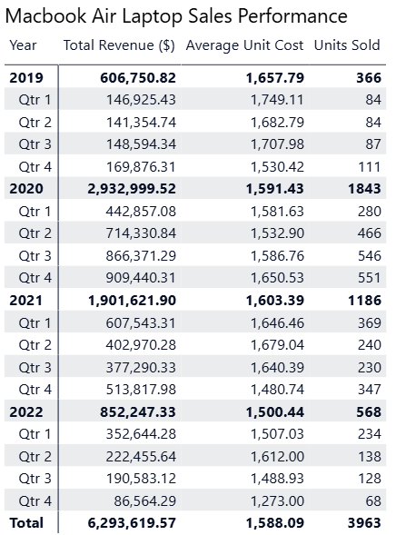
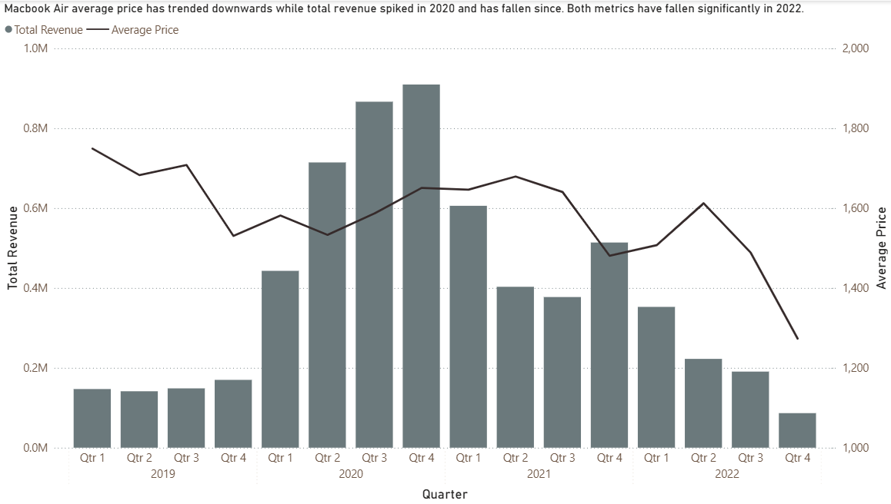
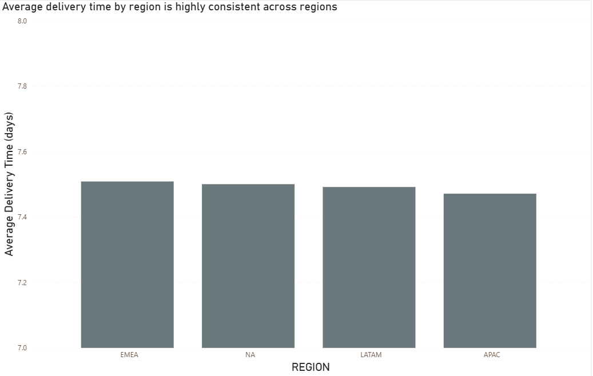
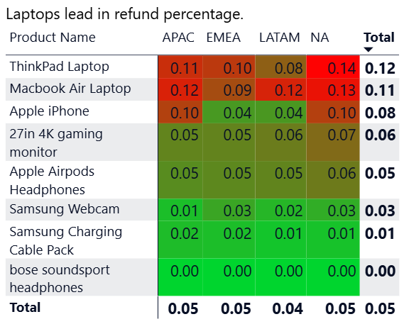
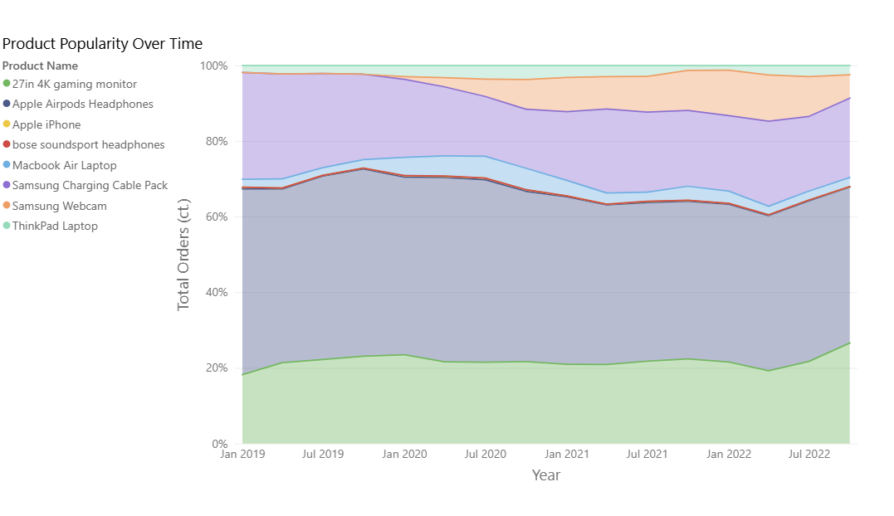
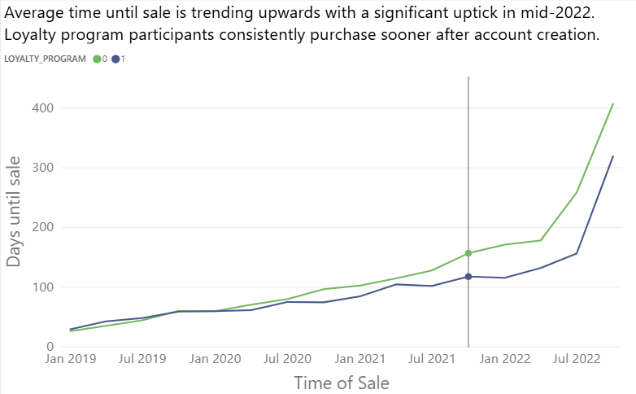

# Elist E-Commerce Analysis Report: 2019–2022

---

## Table of Contents

1. [Executive Summary](#executive-summary)
2. [Data Overview](#data-overview)
3. [Analysis](#analysis)
   - [A1: Macbook Air Laptop Sales Performance by Quarter](#a1-macbook-air-laptop-sales-performance-by-quarter)
   - [A2: Average Delivery Time by Region](#a2-average-delivery-time-by-region)
   - [A3: Refund Rate and Refund Count by Product](#a3-refund-rate-and-refund-count-by-product)
   - [A4: Most Popular Product by Region](#a4-most-popular-product-by-region)
   - [A5: Time to Purchase — Loyalty vs. Non-Loyalty Customers](#a5-time-to-purchase--loyalty-vs-non-loyalty-customers)
4. [Conclusion & Recommended Next Steps](#conclusion--recommended-next-steps)

---

## Executive Summary

Elist is a global consumer electronics retailer which offers eight different products through both website and mobile platforms. This report examines sales, shipping, and customer data for the company for the 2019–2022 period. Analysis is focused on 5 core questions with the overall goal of identifying actionable opportunities for improvement.

**Key Highlights**

**A1 — Macbook Air Revenue:**
Revenue peaked in 2020 with $2.9M in sales. 2021 and onwards sales volume has been dropping consistently. This worrying trend seems to be continuing as Q4 2022 is the worst quarter in the dataset in terms of both order volume and AOV ($86k, 68 units).

**A2 — Regional Delivery Time:**
Delivery time is remarkably consistent between regions. From order to delivery all regions average approximately 7.5 days, with a variance of less than 0.1 days. Our delivery workflow seems to be functioning as intended and is not a cause for concern.

**A3 — Product Refund Rates:**
Elist has an average refund rate of 5%, with high variance across products. Laptops drive the high return rate, with ThinkPads at 12% and Macbooks at 11%. Samsung webcams (3%) and Samsung charging cable pack (1%) lead with low return rates and high sales volume.

**A4 — Product Popularity:**
Sales volume is consistently dominated by three products: Airpods as the clear most popular product (41.2% of sales), gaming monitor (26.6%), and charging cables (21%). Apple iPhone and Bose Soundsport Headphones severely underperform.

**A5 — Loyalty Program Efficacy:**
Loyalty program participants make a purchase sooner on average. After program introduction in 2019, this divide has become more pronounced over time. In mid-2022, average time to buy increased sharply for both groups, signaling a slowdown in converting new users to purchases.

---

## Data Overview

The dataset covers Elist e-commerce transactions from 2019–2022, drawn from four tables: orders, customers, order status, and a geographic lookup that maps countries to regions (NA, EMEA, APAC, LATAM). Orders were placed via website or mobile across eight products. Refund rate is calculated as the share of orders with a recorded refund timestamp. Days-to-purchase measures the time between account creation and first order.

---

## Analysis

### A1: Macbook Air Laptop Sales Performance by Quarter

*Macbook Air orders aggregated by quarter across all regions, 2019–2022.*

#### Results

#### Visualization

#### Insights

**2020 was by far the most successful year:**
With $2.9M in sales and 1,843 units, this aligns with pandemic demand.

**Decline began in early 2021:**
Revenue down to $1.9M and a general decline from pandemic highs. Q4 2021 shows an increase in revenue, likely due to holiday purchases. This increase reverts in Q1 2022.

**Decline is accelerating in late 2022:**
With Q4 2022 showing only 68 purchases, this is the first quarter to undercut pre-pandemic performance. This represents an 88% reduction in purchases from 2020 heights, despite a significantly lower AOV. This product likely needs urgent intervention.

---

### A2: Average Delivery Time by Region

*Average delivery time in days per region, across all years and platforms (null regions excluded).*

#### Results

| Region | Avg. Delivery Time (Days) |
|---|---|
| EMEA | 7.51 |
| NA | 7.50 |
| LATAM | 7.49 |
| APAC | 7.47 |

_Regions ranked from longest to shortest average delivery time._

#### Visualization

#### Insights

**Delivery time is highly consistent:**
All regions deliver in approximately 7.5 days, with little variance between regions and orders.

**Highly standardized delivery:**
Consistency regardless of region showcases a robust fulfillment pipeline. This is a key strategic strength for Elist.

---

### A3: Refund Rate and Refund Count by Product

*Refund flagged when `refund_ts` was present; refund rate expressed as % of total orders per product.*

#### Results

| Product | Refund Rate (%) |
|---|---|
| ThinkPad Laptop | 12% |
| Macbook Air Laptop | 11% |
| Apple iPhone | 8% |
| 27in 4K Gaming Monitor | 6% |
| Apple Airpods Headphones | 5% |
| Samsung Webcam | 3% |
| Samsung Charging Cable Pack | 1% |
| Bose Soundsport Headphones | 0% |

_Products sorted by refund rate (high to low). Overall refund rate across all products: 5%._

#### Visualization

#### Insights

**Laptops drive the majority of refunds:**
ThinkPads and Macbook Airs are returned over 10% of the time. At over double the company average, this indicates a potential problem with laptop QC.

**Three core products have acceptable rates:**
Gaming monitor (6%), Airpods (5%), and Samsung Charging Cable Pack (1%) are all near or below the average 5% return rate. Comprising 90%+ of sales volume, these products are good indicators of overall business health.

**Bose Headphones are a misleading outlier:**
Though 0% return for the headphones is encouraging, this is entirely attributable to extremely low sales volume (27 units, 2019–2022). Product discovery is likely not working as intended.

---

### A4: Most Popular Product by Region

*Order counts aggregated by region and product; top product per region identified by highest order count.*

#### Results

| Region | Most Popular Product | Order Count |
|---|---|---|
| NA | Apple Airpods Headphones | ~25,000 |
| EMEA | Apple Airpods Headphones | ~15,000 |
| APAC | Apple Airpods Headphones | ~5,500 |
| LATAM | Apple Airpods Headphones | ~2,500 |

#### Visualization

#### Insights

**Apple Airpods are the clear most popular product:**
Across regions and quarters, the Airpods consistently account for 40–45% of product volume.

**Gaming Monitor and Charging Pack are consistently popular items:**
Consistently the 2nd and 3rd most popular products, they account for ~20% of product volume each.

**iPhone and Bose Headphones are extremely unpopular:**
Consistently rank as by far the least popular products, suggesting poor market visibility.

---

### A5: Time to Purchase — Loyalty vs. Non-Loyalty Customers

*Days between `created_on` and `purchase_ts` averaged by loyalty status (1 = member, 0 = non-member); null loyalty values excluded.*

#### Visualization

#### Insights

**Loyalty members purchase sooner:**
On average, loyalty program members purchase sooner than non-member customers.

**The effect of membership is increasing:**
As the program matures, loyalty members show a consistently larger purchase time advantage over non-members.

**Major increase in time to purchase mid-2022:**
Both groups have shown rapidly increasing time to purchase since mid-2022, indicating a major new problem with converting potential customers into buyers.

---

## Conclusion & Recommended Next Steps

### Recommended Next Steps

| Priority | Recommendation | Supporting Finding |
|---|---|---|
| High | Review laptop delivery pipeline and quality control. Focus on Macbook Air due to good historic performance | Laptop returns are higher than any other product category (A3) and Macbook orders are significantly down (A1). |
| High | Launch engagement programs for existing customer base. Generate a sense of urgency to buy via limited-time promotions. | Customers show rapidly increasing time-to-purchase as of 2022 (A5). |
| Medium | Launch sign-up campaigns for existing users. Loyalty program membership has a proven effect on time-to-purchase and expanding the program should drive increased sales. | Loyalty program participants purchase sooner on average (A5). |
| Medium | Launch international marketing campaigns targeting LATAM and APAC. Both regions show significantly lower sales despite effective supply chains in both areas. Targeted advertisement has the potential to drive a massive increase in sales. | Sales are relatively low in LATAM and APAC (A4) and delivery infrastructure is already established (A2). |
| Medium | Discontinue or change product strategy for the iPhone and Bose headphones. Both products sell very poorly and should be evaluated for potential discontinuation. | Sales for both products are negligible (A3). |

---

_Report prepared using SQL queries against the Elist core data warehouse (BigQuery). Data covers January 2019 – December 2022. Visualizations generated in Power BI._
